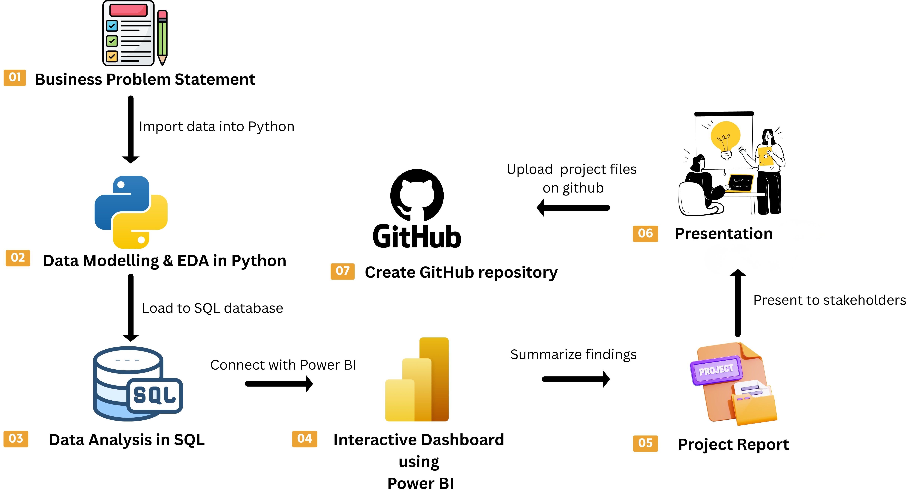

# 👨🏻‍💻 Customer Behavior Data Analysis

This project represents a **complete, industry-standard, end-to-end data analytics workflow**, designed to mirror the real-world responsibilities of professional data analysts in modern business environments.

It demonstrates how raw customer data can be transformed into **actionable business intelligence** through structured analysis, visualization, reporting, and presentation.

---

## 📌 Project Overview

The primary objective of this project is to **simulate a corporate-grade analytics pipeline**, showcasing the ability to move from unstructured data to strategic insights that support business decision-making.

### Key Goals:
- Translate raw customer data into meaningful insights
- Apply Python, SQL, and Power BI in a cohesive workflow
- Communicate insights clearly through reports and presentations

---

## 🔄 End-to-End Analytics Workflow

The project follows a structured, real-world analytics lifecycle:

### Workflow Stages:
1. **Business Problem Definition**
2. **Data Preparation, Modeling & EDA (Python)**
3. **Data Analysis (SQL)**
4. **Interactive Dashboard (Power BI)**
5. **Project Report**
6. **Presentation using Gamma AI**
7. **Version Control & Documentation (GitHub)**

---

## ✅ Project Components

### 🐍 Data Preparation, Modeling & EDA (Python)
- Import and inspect raw customer data
- Clean and transform datasets
- Perform exploratory data analysis (EDA)
- Prepare data for database storage

### 🗄️ Data Analysis (SQL)
- Load processed data into a SQL database
- Simulate business transactions
- Write SQL queries to answer business questions related to:
  - Customer segments
  - Purchasing behavior
  - Loyalty patterns
  - Revenue drivers

### 📊 Visualization & Insights (Power BI)
- Connect SQL database to Power BI
- Build an interactive dashboard
- Highlight key trends, KPIs, and patterns
- Enable data-driven decision-making for stakeholders

### 📝 Report & Presentation
- Summarize findings in a structured project report
- Provide business-focused insights and recommendations
- Create a professional presentation using **Gamma AI**
- Communicate insights effectively to non-technical stakeholders

---

## 🛠️ How to Use This Project

### 1️⃣ Clone the Repository

git clone https://github.com/MADHACKER85/Customer_trends_analysis.git

### 2️⃣ Python Analysis "Open the notebook":

Customer_Shopping_Behavior_Analysis.ipynb

**This notebook includes:**

*Data Import

*Data Exploration

*Data Cleaning

*Feature Engineering

*SQL Database Connection

*Loading data into SQL

### 3️⃣ SQL Analysis

*Create a database in MySQL / PostgreSQL / MS SQL Server

*Load data using the Python notebook

*Open and execute:

customer_behavior_sql_queries.sql

*Answer business questions using SQL queries

### 4️⃣ Power BI Dashboard
*Connect Power BI to the SQL database

Open:
customer_behavior_dashboard.pbix

*Explore interactive dashboards and insights
### 5️⃣ Reporting & Presentation

*Create a detailed project report

*Build a professional presentation

*Present insights and recommendations to stakeholders

### 🚀 Skills Demonstrated

*Python (Pandas, NumPy, EDA, Feature Engineering)

*SQL (Joins, Aggregations, Business Queries)

*Power BI (Data Modeling, DAX, Dashboards)

*End-to-End Data Analytics Workflow

*Business Intelligence & Storytelling

*Stakeholder Communication

*Version Control with GitHub

